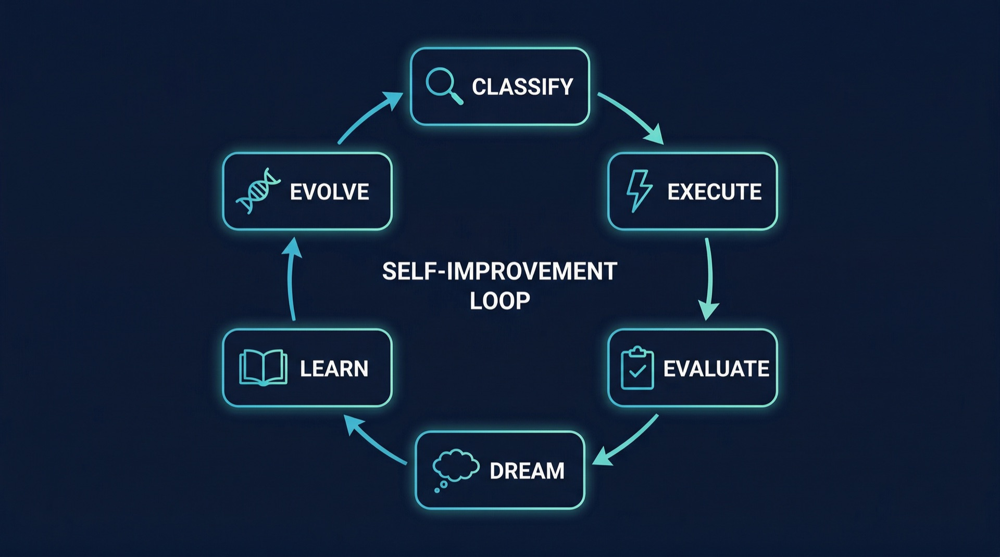
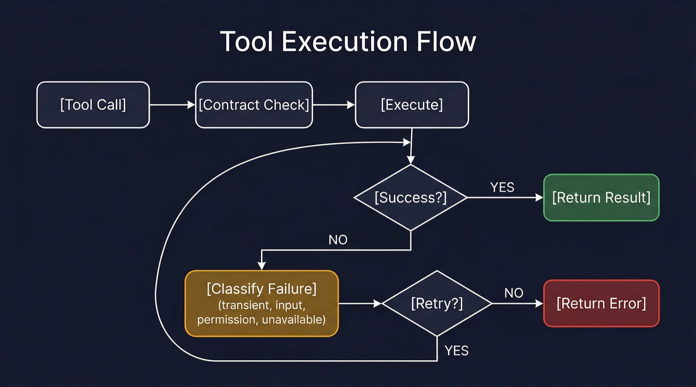
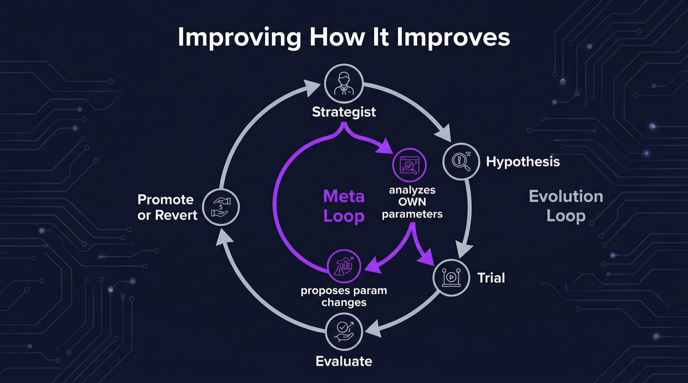
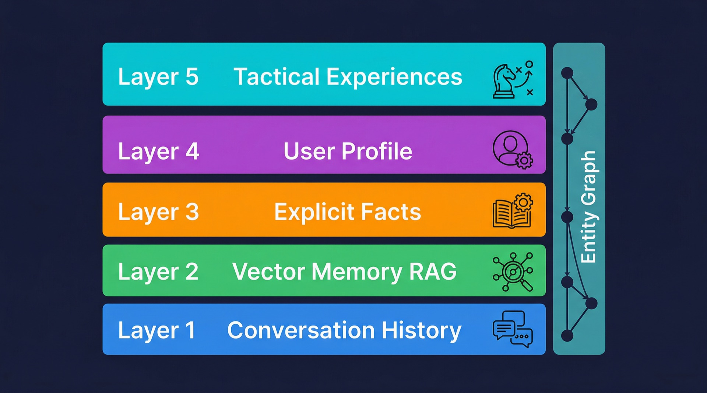

<p align="center">
  
</p>

<h1 align="center">Odigos</h1>

<p align="center">
  <strong>Your personal AI that gets smarter every day.</strong><br>
  Deploy it anywhere, connect any LLM, and get an assistant that remembers everything,<br>
  learns from its mistakes, writes and saves its own tools, and improves its own behavior.
</p>

<p align="center">
  <a href="#quick-start">Quick Start</a> ·
  <a href="#what-can-it-do">Features</a> ·
  <a href="#evolution-engine">Self-Improvement</a> ·
  <a href="#memory-system">Memory</a> ·
  <a href="https://github.com/tamler/odigos/wiki">Wiki</a> ·
  <a href="#license">MIT License</a>
</p>

---

## Why Odigos?

Most AI assistants are stateless -- every conversation starts from scratch. Odigos is different:

- **It remembers.** Durable knowledge persistence: wiki-style markdown files that survive database drops, structured entity/fact extraction on every conversation turn, provenance tracking (every fact links back to where it was learned), and a background lint pass that audits for stale claims and contradictions. It knows who you are, not just what you said.
- **It improves itself.** A built-in evolution engine evaluates every response, runs experiments on its own behavior, and promotes changes that work. No manual prompt tuning.
- **It builds its own tools.** When the agent writes code that solves a problem, it can save it as a reusable executable skill. Next time a similar problem comes up, the tool is already there.
- **It understands complex requests.** An adaptive classifier routes simple questions fast and decomposes complex ones into sub-tasks. The agent tracks its plan, learns from errors, and gets better at routing over time.
- **It stays sharp.** AREW-inspired critique signals detect when the agent stops using its tools effectively or ignores information it retrieved, then automatically propose and test fixes.
- **It's yours.** Self-hosted. Your data stays on your machine. One agent, one owner -- no shared infrastructure, no data leaving your network.

## Quick Start

You need an LLM API key ([OpenRouter](https://openrouter.ai/keys), OpenAI, Ollama, or any OpenAI-compatible provider).

```bash
git clone https://github.com/tamler/odigos.git && cd odigos
```

**Docker (recommended):**
```bash
bash install.sh
```

**Bare metal (Ubuntu, Debian, RHEL, macOS):**
```bash
bash install-bare.sh
```

Open **http://localhost:8000**, create your account, and start chatting.

## What Can It Do?

### Talk and remember
Chat through the web dashboard (mobile-friendly), Telegram, or the API. Responses stream word-by-word. The agent builds a profile of you over time -- your communication style, expertise, preferences -- by analyzing conversations in the background. Tell it "remember that I prefer concise answers" and it stores that as an explicit fact. Everything persists across conversations.

### Notebooks and journals
Built-in markdown notebooks with agent integration. Start a journal and the agent offers guided prompts, tracks your mood, and recognizes patterns. The agent reads notebook content contextually when you're on the page and can suggest or add entries based on collaboration level.

### Kanban boards
Shared kanban boards between you and the agent. Create boards, manage cards with drag-and-drop, and the agent has full read/write access via tools. Ask it to create tasks, move cards as work progresses, or summarize what's in progress. Your board is a shared workspace for getting things done.

### Create files and artifacts
Ask the agent to generate a spreadsheet, report, or document and it creates a downloadable file. Supports CSV, Markdown, JSON, HTML, TXT, XML, YAML, and DOCX (Word documents). Files appear as download cards in the chat.

### Deep research
Say "research the competitive landscape for X" and walk away. The agent decomposes your question into sub-topics, searches multiple sources per topic, cross-references findings, self-reviews for gaps, then produces a comprehensive report (DOCX or Markdown) with a sources CSV. You get a notification when it's done.

### Search and research
Web search (SearXNG, Brave, or Google), web scraping, RSS feeds. Upload documents and the agent indexes them for retrieval. Ask questions across all your documents -- the agent writes code to search them programmatically when simple retrieval isn't enough. All results include clickable source links.

### Execute code
Sandboxed Python and shell execution with memory limits, timeouts, and network isolation. The agent can write and run code to solve problems, then save working solutions as reusable tools.

### Manage your life
Goals, todos, reminders with proactive follow-up. Cron jobs for recurring tasks. The agent checks in via its heartbeat loop and nudges you when things are due. It detects commitments in your messages ("I'll do that by Friday") and follows up. When idle, it researches open questions and incomplete plans in the background.

### Analytics
Built-in analytics dashboard showing query classifications, skill usage, tool errors, and active plans. See how your agent is performing at a glance.

### Email
Connect your agent to any email account via standard IMAP/SMTP. The agent checks for new mail, notifies you, reads messages when asked, and sends replies on your behalf. No OAuth setup -- just provide credentials in Settings.

### Quizzes and assessments
The agent can create interactive quizzes, grade responses with explanations, and track learning progress. Use it for self-study, tutoring, training, or professional development.

### Suggested actions
When the agent offers next steps, they appear as clickable buttons you can tap instead of typing. Pick one, pick several, or "Do all" to queue everything. The agent works through them and reports back.

### Agent profiles
Pre-built configurations for common use cases: personal assistant, learner, mentor, researcher, writer, sales agent. Apply a profile to set the right tools, skills, and features in one click. Or customize your own.

### Calendar
Connect your calendar via CalDAV (Google, Apple, Outlook, Nextcloud). The agent checks upcoming events and includes them in morning briefings. No proprietary integrations -- standard CalDAV protocol.

### News monitoring
Tell the agent to watch RSS feeds for topics you care about. "Follow TechCrunch for AI news." The agent checks feeds periodically, filters by your topics, and surfaces relevant articles with clickable links.

### Translate
Ask the agent to translate text between 100+ languages. Auto-detects the source language. Powered by Google Translate -- no API key needed.

### Knowledge lookup
The agent can look up factual information from Grokipedia (primary) and Wikipedia (fallback) before answering questions. Saves LLM tokens and improves accuracy on factual queries.

### Text analysis
Built-in NLP via TextBlob: spell checking, sentiment analysis, language detection, and noun phrase extraction. Used throughout the system -- the evaluator tracks user sentiment, the entity graph extracts noun phrases, and commitment detection uses sentence-level analysis instead of regex.

### Generate images
Ask the agent to create images -- photos, illustrations, logos, charts, product mockups, storyboards, UI designs. Powered by Kie.ai Z-Image with a built-in prompt expansion guide that turns simple requests into detailed, optimized prompts. Generated images appear inline in chat with download and share options. The agent can also process existing images (resize, crop, convert, rotate, thumbnail) and chain generation with processing -- generate an image, then resize it for a specific platform.

### Image processing and OCR
Resize, crop, convert, rotate, thumbnail, and extract text (OCR) from images. Upload a receipt and the agent reads it. Photo a sign in another language and the agent translates it. Scan a document and the agent ingests the text. Powered by Tesseract OCR with multi-language support.

### Data tracking
The agent can create and maintain structured data tables -- budgets, expense logs, reading lists, workout trackers, habit logs, inventory. Data lives in the database, not files. The agent queries it, summarizes it ("you spent $247 today"), and exports to Excel on demand. Combined with OCR, the agent scans receipts and automatically logs expenses.

### QR codes
Generate QR codes for URLs, WiFi credentials, contact info, or any text. The agent produces a downloadable PNG. Share a link, a WiFi password, or a vCard via QR.

### Calendar events
Create downloadable .ics calendar event files importable into any calendar app (Apple Calendar, Google Calendar, Outlook). The agent generates events with title, time, location, and description.

### Work with your tools
Google Workspace (Gmail, Calendar, Drive), browser automation, MCP server integration, file management. Extend with plugins -- no restart required.

### Voice input and speech
Tap the mic button to record, tap again to stop. Audio is transcribed server-side via Groq Whisper and the text appears in the input field for review before sending. Server-side WebRTC VAD filters silence before it reaches Whisper (no wasted API calls). Edge-tts reads responses aloud in voice mode with 30 selectable voices. Adaptive silence threshold calibrates to ambient noise.

### Install as an app (PWA)
Odigos is a Progressive Web App. On mobile or desktop, "Add to Home Screen" and it runs full-screen without browser chrome. Push notifications reach you when the app is closed -- task reminders, email alerts, follow-ups, morning briefings. Long-press the app icon for shortcuts: New Chat, Journal, Board, Voice Memo. Biometric login (fingerprint/Face ID) via WebAuthn passkeys -- register once, sign in without typing a password.

### Cross-channel awareness
Switch between web dashboard, Telegram, and API without losing context. The agent knows what you were last talking about regardless of which channel you were on.

### Connect with other agents
Mesh networking with WebSocket auto-connect, mutual authentication, and heartbeat monitoring. Agents connect on startup, reconnect with exponential backoff, and can message each other in real-time. Supervised mode for managed agents with locked settings.

## Evolution Engine

<p align="center">
  
</p>

Odigos improves itself without human intervention. The evolution engine runs a continuous loop:

### The Loop

**Classify → Execute → Evaluate → Dream → Learn → Evolve**

1. **Classify** -- Every message is categorized (simple, standard, document_query, complex, planning) using a two-tier system: fast heuristic rules first, LLM-based classification for uncertain cases. The rules themselves are [evolvable](https://arxiv.org/html/2603.11808v1) -- stored in editable markdown files that the evolution engine can modify.

2. **Execute** -- The ReAct-style executor runs tools in a loop until the LLM responds without tool calls. Each classification has routing rules that control which tools are available, whether to skip RAG, and which context sections to include -- saving tokens on simple queries.

3. **Evaluate** -- The evaluator runs two assessments: rubric-based scoring (generates a rubric for the task type, then scores against it) and implicit feedback detection (did the user correct the agent? thank it? ignore it?). [AREW-inspired](https://arxiv.org/abs/2603.12109) critique signals score tool usage quality.

4. **Dream** -- During idle heartbeat cycles, the agent analyzes conversations to build a user profile, extracts tactical experiences from tool successes/failures, and mines repeated tool patterns that could become reusable skills.

5. **Learn** -- The strategist aggregates evaluation data, query classification stats, skill usage patterns, and AREW critique scores. It proposes hypotheses: "document queries would improve if we forced tool use" or "this repeated 3-tool pattern should become a skill." High-confidence proposals are auto-executed.

6. **Evolve** -- Proposals become time-boxed trials. The checkpoint manager snapshots the current state, applies the change, and monitors evaluation scores. After enough data, trials are promoted (change kept) or reverted (rolled back). Classification rules, routing, prompt sections, and skills all evolve this way.

### What Evolves

| Component | How it changes |
|-----------|---------------|
| Classification rules | Heuristic patterns in `classification_rules.md` |
| Routing rules | Per-classification tool filtering, RAG skipping in `routing_rules.md` |
| Prompt sections | Identity, voice, meta instructions in `data/agent/*.md` |
| Skills | New skills auto-created from detected patterns |
| Experiences | Tactical lessons stored and injected into future context |
| Evolution parameters | The strategist tunes its own confidence thresholds, trial durations, and evaluation minimums |

### Smart Tool Registry

The agent has 45+ tools but never presents them all at once. Research shows LLM tool selection degrades above 15-20 tools in context. The registry uses a three-layer approach:

1. **JIT schema injection** -- When a query arrives, the classifier determines its type. The executor looks up which tools were historically used for this type (from the query log) and injects their full schemas into the LLM call. The agent gets the most likely tools ready to use immediately, saving a round trip.
2. **Progressive discovery** -- the `find_tools` meta-tool is always included as a fallback. If the JIT-injected tools don't cover the query, the agent searches for specialized capabilities by description ("send email", "create kanban card"). Matching tools are returned with descriptions so the agent knows what's available without loading every schema.
3. **Dynamic adaptation** -- As usage patterns change (new tools added, user behavior shifts), the JIT injection adapts automatically. No static mapping to maintain.

Tools are organized in a type hierarchy: `APITool` (external HTTP APIs with shared connection pooling, polling, and retry), `CLITool` (subprocess execution with input hardening and JSON-first output), and local tools (code, file, notebook). All tools share a standard contract: category, description, parameter schema with enum constraints (reducing parameter hallucination by 60% per Gorilla research), and execution policy (retry counts, timeouts, cost limits). The executor validates all parameters against the JSON schema before execution, catching hallucinated values in 1ms instead of waiting for an API error.

Tool results are filtered before reaching the context window. Each tool defines a `format_for_context()` method to summarize its output. For tools that don't override this, an automatic distillation heuristic extracts signal (errors, key results) from verbose output, preventing context rot from chatty tools.

### Tool Execution Contracts

<p align="center">
  
</p>

Every tool has an execution contract that defines retry behavior, timeouts, and failure handling. When a tool fails, the error is classified into a failure taxonomy (transient, input, permission, unavailable, unknown) with per-category recovery strategies. Transient failures (timeouts, rate limits, connection resets) are retried transparently with exponential backoff -- the LLM never sees the retry. Input and permission errors surface immediately. This makes the agent resilient to flaky APIs without wasting tool turns.

### Background Tool Execution

Long-running tools (image generation, music generation) run in the background instead of blocking the conversation. When the agent calls `generate_image`, the tool submits the API request, returns immediately with a "pending" status, and the conversation continues. The heartbeat loop polls for completion every 30 seconds. When the result is ready, the artifact is downloaded, a system message is injected into the conversation ("Image generated: sunset.png"), and a WebSocket notification pushes to the frontend. The user gets a toast and the result appears in chat -- even if they've moved to a different conversation.

### Autonomous Behavior

The agent works proactively during idle time. When no user messages are pending, the heartbeat picks up in-progress plans and executes the next pending step autonomously using headless mode -- a lightweight execution path that replaces full conversation history with a plan context summary (goal, completed steps, current step) while keeping RAG, experiences, and entity knowledge. This saves ~67% of tokens on background work compared to replaying the full chat history. Every tool call carries goal ancestry -- a reference to the user goal or plan step that motivated it -- so the evaluator scores actions against the original intent, not just keyword overlap. Completed autonomous work is logged in a session table and injected into context for the next cycle, so the agent picks up where it left off.

Near budget limits, the agent throttles gracefully: it switches to the background model, caps remaining tool turns, and injects a conciseness instruction. This is a gradual degradation, not a hard wall.

### Meta-Improvement

<p align="center">
  
</p>

The strategist doesn't just improve the agent -- it improves how improvement works. When domain performance trends suggest the evolution system itself is miscalibrated (e.g., trials are too short to accumulate enough data, or confidence thresholds are too permissive), the strategist proposes changes to its own parameters. These meta-proposals become trials evaluated by the same system. If the change produces better outcomes, it's promoted. If not, it's reverted. The agent literally tunes its own improvement process.

## Skill System

Skills are reusable instruction sets that the agent activates for specific tasks. Unlike tools (which execute code), skills modify how the agent thinks and responds.

### Text Skills
Markdown files in `skills/` with a name, description, tool list, and instructions. When activated, the skill's full prompt is injected into the conversation. Examples: `deep-research` (multi-round investigation), `journal` (reflective journaling), `tutor` (Socratic teaching), `mentor` (curriculum management).

### Executable Skills
When the agent writes Python code that solves a reusable problem, it can save the code as an executable skill via `create_skill`. The code defines a `run()` function with typed parameters. Saved skills appear as callable tools -- the agent can invoke them directly on future queries. Inspired by [SAGE](https://arxiv.org/html/2512.17102v2).

### Skill Mining
The strategist monitors tool usage patterns. When it detects a combination of tools being used repeatedly with high evaluation scores, it proposes creating a new skill that encapsulates the pattern. Skills are born from real successful interactions, not pre-programmed.

### Skill Lifecycle
1. Agent encounters a task → activates a relevant skill (or works without one)
2. Evaluator scores the result
3. Strategist detects repeated patterns → proposes new skill
4. Evolution engine trials the skill → promotes if scores improve
5. Agent uses the skill on similar future tasks

## Plan System

For complex multi-step requests, the agent decomposes work into tracked plans.

### Decomposition
The `decompose_query` tool breaks a request into 2-6 sequential sub-tasks. Each step has a description, status (pending/in_progress/done/failed), and optional result notes. Steps can have sub-steps for nested complexity.

### Tracking
Plans persist in the database across conversation turns. The agent uses `check_plan` to review progress and `update_plan` to mark steps complete. The context assembler injects a recovery briefing if a plan was interrupted -- so the agent picks up where it left off, even in a new conversation.

### Dual-Loop Verification
After updating a plan step, the executor injects a verification prompt: "Before proceeding to the next step, verify the result of the current step is correct and complete." This catches errors mid-plan instead of at the end.

### Outcome Evaluation
When all steps are done, the plan outcome is evaluated: did the plan achieve its goal? The outcome score feeds back into the strategist, informing future decomposition strategies.

## Memory System

<p align="center">
  
</p>

Odigos has a durable, layered memory architecture. Knowledge persists in markdown files on disk (surviving database drops) while the database provides fast operational access.

### Durable Layer: Wiki Files
Compiled knowledge lives in `data/wiki/` as structured markdown with YAML frontmatter. Entity pages, topic indexes, and conversation summaries are written by the heartbeat and can rebuild the database from scratch if it's lost. External content (scraped pages, documents) is archived as cleaned markdown in `data/sources/` -- immutable, with SHA-256 dedup.

### Structured Extraction
Every conversation turn runs a dedicated extraction pass (separate from the main response) that identifies entities, facts, and relationships in structured JSON. This replaces fragile inline parsing with guaranteed extraction via the LLM's structured output mode. Facts are SHA-256 deduped at write time; semantic dedup runs in periodic lint passes.

### Provenance
Every entity and fact tracks where it came from -- conversation ID, document ID, or scraped source. Wiki files render these as inline citations. The lint pass validates that referenced sources still exist.

### Vector Memory (RAG)
All conversation messages and uploaded documents are chunked, embedded (nomic-embed-text-v1.5, local CPU), and stored in sqlite-vec for vector search. Hybrid retrieval: vector similarity + FTS5 full-text search with set-union merge, then cross-encoder re-ranking (ms-marco-MiniLM).

### Explicit Facts
The agent stores discrete facts in `user_facts` with categories, provenance, and confidence scores. Facts are injected into every conversation's context.

### User Profile (Dreaming)
During idle heartbeat cycles, the agent analyzes recent conversations to build a structured user profile -- communication style, expertise, preferences, engagement patterns. Built automatically without the user explicitly stating anything.

### Tactical Experiences (XSkill)
The agent learns from tool usage. Successes and failures are stored with context, outcome, and lessons. A confidence score tracks reliability. Stale experiences are automatically pruned. Inspired by [XSkill](https://arxiv.org/html/2603.12056v2).

### Entity Graph
An entity graph tracks people, tools, documents, and concepts across conversations. Entities are linked with typed relationships, confidence scores, and provenance. Multi-hop traversal (2-hop BFS) pulls in related entities automatically. Relationship paths are shown in context so the agent can trace reasoning chains.

### Wiki Maintenance
A heartbeat phase projects changed entities to wiki files every 30 seconds. A lint pass runs every 5 minutes: flags stale claims, orphan entities, contradictions, and missing cross-references. Semantic dedup generates merge proposals (not destructive auto-merges). Findings are logged to `data/wiki/log.md`.

### Database Rebuild
If the database is lost but `data/wiki/` exists, the system automatically rebuilds entity, fact, and edge tables from the wiki files on startup. Conversation summaries provide context for what was discussed. Auto schema evolution detects and adds missing columns without migration files.

### Active Reasoning Critique
Inspired by [AREW](https://arxiv.org/abs/2603.12109), the evaluator scores two dimensions after every response: **Action Selection** (did the agent use appropriate tools to gather information?) and **Belief Tracking** (did the agent actually use the information it retrieved?). User sentiment is tracked on every message via TextBlob NLP -- polarity and subjectivity feed directly into the evolution engine. These signals feed into the strategist, which proposes improvements when the agent shows patterns of ignoring its own memory or tools.

## Architecture

One process. One database. No microservices.

- **FastAPI** with WebSocket for real-time streaming chat
- **SQLite** with vector search (sqlite-vec) and full-text search (FTS5)
- **Local embeddings** (nomic-embed-text-v1.5) on CPU -- no API calls for embedding
- **Cross-encoder reranking** (ms-marco-MiniLM) for document retrieval accuracy
- **NLP layer** (TextBlob) for sentiment analysis, entity extraction, spell checking, commitment detection
- **Plugin system** for tools, channels, and providers
- **Smart tool registry** with category-based filtering and progressive discovery via `find_tools`
- **Unified storage layer** (`storage.py`) -- single source of truth for all file paths
- **Unified HTTP client** (`api.ts`) -- all frontend HTTP through one module with CSRF
- **Unified LLM wrapper** (`call_llm`) -- standard retry, logging, and cost tracking
- **Single-task prompts** -- each LLM call does one thing. Entity extraction, correction detection, classification, evaluation, and profiling are separate calls. No multi-task prompts that mix response generation with metadata extraction.
- **MessageBus** -- single `publish()` interface for all message storage and delivery. Writes to DB (source of truth) and pushes to all channel adapters. Idempotency keys prevent duplicate messages from callbacks. Pre-allocated message IDs correlate streaming chunks with final stored messages.
- **Channel-agnostic identity** -- conversations use plain UUIDs (no channel prefix). Each message tracks its originating channel independently. Same conversation accessible from web, Telegram, or API.
- **Auto schema evolution** -- on startup, compares `schema.sql` column definitions against the live database and adds missing columns via ALTER TABLE. No migration files needed.
- **Background processing** -- structured entity/fact extraction runs as a dedicated LLM call after each response. Long-running tools (image/music generation) execute asynchronously via heartbeat polling.
- **Heartbeat loop** -- modular 10-file package (orchestrator, scheduled, todos, plans, peers, idle, profiling, maintenance, background, wiki_maintenance) for goal tracking, evolution trials, proactive plan execution, background task polling, wiki file projection, knowledge lint, nudges, follow-up detection, idle research, auto-updates, storage quota monitoring. Headless execution mode uses plan context summaries instead of full chat history (~67% token savings).
- **Tool type hierarchy** -- `APITool` (shared HTTP client, polling, retry), `CLITool` (subprocess, input hardening, JSON-first), and local tools. Parameter validation via jsonschema. Observation filtering via `format_for_context()` with auto-distill fallback.
- **Failure taxonomy** classifies tool errors (transient, input, permission, unavailable) with per-category retry strategies
- **Parallel context assembly** -- 13 context queries run concurrently via asyncio.gather
- **WebRTC VAD** -- server-side voice activity detection prevents sending silence to Whisper
- **Config backup** -- settings backed up before every write (3 versions retained)

Everything runs on a single VPS. 4 CPU, 16GB RAM is comfortable. No external databases, no message queues, no container orchestration.

### Auto-Update

Enable `auto_update.enabled: true` in config.yaml and the agent checks git for new commits during its heartbeat loop. When updates are found, it can notify you or auto-apply (pull, rebuild dashboard, restart). Works on both systemd (bare metal) and Docker installs.

### Config Validation

On startup, Odigos validates your configuration and logs warnings for common issues: missing API keys, invalid provider names, inconsistent budget limits, incomplete email/calendar config. The agent still starts -- warnings help you fix config without blocking.

## Dashboard

The web dashboard features:

- **Unified workspace** -- every page (notebooks, kanban, settings) has an agent input bar at the bottom with page context awareness. Press `/` to focus from anywhere. The agent knows what page you're on and what you're looking at.
- **Chat** with streaming responses, file uploads, voice I/O
- **Notebooks** with journal mode and contextual agent chat
- **Kanban boards** with drag-and-drop columns and cards
- **Cowork layout** -- any page can have a slide-out chat panel alongside it
- **Workspace search** -- the agent can search across notebooks, boards, and conversations via tools
- **Contextual links** below the chat input for quick access to Journal, Board, Documents
- **Settings** with analytics, mesh status, peer configuration, and all agent settings
- **Keyboard shortcuts** -- Escape, Cmd+K, Cmd+N, `/` to focus agent input
- **PWA** -- installable on mobile and desktop, push notifications, app shortcuts, biometric login
- **Draft persistence** -- unsent messages survive tab closes and disconnects
- **Dark/light theme**
- **Mobile responsive**

## Configuration

Two files:

- **`.env`** -- Secrets (LLM API key, session secret)
- **`config.yaml`** -- Everything else (models, budget, tools, plugins)

Key settings:

| Section | What it controls |
|---------|-----------------|
| `llm` | Models, temperature, base URL |
| `budget` | Daily/monthly spending caps |
| `agent` | Name, tool turn limits, timeouts |
| `approval` | Which tools need human sign-off |
| `evolution` | Trial duration, thresholds |
| `notebooks` | Enable/disable notebooks |
| `kanban` | Enable/disable kanban boards |
| `mesh` | Enable/disable agent mesh networking |
| `email` | IMAP/SMTP credentials for agent email |
| `access` | Supervised mode for managed agents |
| `voice` | TTS/STT provider, voice selection, voice mode |
| `auto_update` | Automatic code updates from git |
| `calendar` | CalDAV calendar integration |
| `assistant` | Floating assistant bubble settings |
| `image_generation` | Kie.ai Z-Image API for image creation |
| `storage` | Per-agent storage quota (warn/cap thresholds) |

## Plugins

| Plugin | What it adds |
|--------|-------------|
| Web Search | SearXNG, Brave, or Google search |
| Google Workspace | Gmail, Calendar, Drive (requires gcloud setup) |
| Agent Browser | Browser automation |
| Telegram | Telegram bot interface |
| TTS/STT | Voice input and output (pluggable providers: Groq, edge-tts, local) |
| Docling | Deep document extraction |

Enable in the Plugins tab. Changes apply immediately.

## Security

- **Auth:** Username/password with signed HTTP-only session cookies. API key for programmatic access. All endpoints require authentication.
- **Sandbox:** Code runs in bubblewrap isolation with memory/timeout limits.
- **Upload validation:** Blocked file extensions (.exe, .sh, .php, etc.) and magic byte detection for renamed executables.
- **Path containment:** All file-access tools enforce boundary checks -- resolved paths must stay within allowed directories. Symlinks are skipped in directory listings and file operations to prevent traversal outside the data directory.
- **Approval gates:** Dangerous tools require human sign-off.
- **Budget controls:** Daily and monthly spending caps.
- **Storage quotas:** Per-agent storage monitoring with configurable warning (10 GB) and soft cap (12 GB) thresholds. The heartbeat checks total data directory size periodically and notifies when approaching limits.
- **SSRF protection:** Private IP ranges blocked in web scraping.
- **Prompt injection defense:** Multi-layer protection against prompt injection in external content (emails, documents, web pages, peer messages, RAG recall). Regex patterns, base64 probe detection, TextBlob NLP analysis, and structural separation (`<external_data>` tags with instruction hierarchy). Canary tokens detect system prompt exfiltration -- leaked tokens are auto-redacted from output. Auto-generated skills are blocked if high-risk injection patterns are detected.
- **Mesh auth:** Mutual API key authentication on WebSocket connections. Prompt injection scanning on all inbound peer messages with re-scan on DB replay.
- **Single-user:** One agent, one owner. Multi-user is handled at the deployment layer.

## Development

```bash
uv sync                        # Install dependencies
uv run pytest                  # Run tests
uv run python -m odigos.main   # Start locally
cd dashboard && npm run dev    # Dashboard dev server
```

## Acknowledgments

- Evolution engine inspired by [autoresearch](https://github.com/karpathy/autoresearch) by Andrej Karpathy
- Active reasoning critique inspired by [AREW](https://arxiv.org/abs/2603.12109) (Active Reasoning with Edge-Weighted)
- Executable skills inspired by [SAGE](https://arxiv.org/html/2512.17102v2) (Skill Augmented GRPO for Self-Evolution)
- Skill mining and three-level loading inspired by [Automating Skill Acquisition](https://arxiv.org/html/2603.11808v1) and [Anthropic Skills](https://github.com/anthropics/skills)
- Experience layer inspired by [XSkill](https://arxiv.org/html/2603.12056v2) (Continual Learning in Multimodal Agents)
- Document analysis inspired by [RLM](https://arxiv.org/html/2512.24601v2) (Recursive Language Models)
- Plan persistence inspired by [planning-with-files](https://github.com/OthmanAdi/planning-with-files)
- User profiling and fact extraction inspired by [ChatGPT's memory architecture](https://manthanguptaa.in/posts/chatgpt_memory/) and [Honcho](https://github.com/plastic-labs/honcho)
- Token efficiency tracking inspired by [jMunchWorkbench](https://github.com/jgravelle/jMunchWorkbench)
- Evolution engine improvements informed by [VISTA](https://arxiv.org/abs/2603.18388) (parallel trials, decoupled hypothesis/rewrite, random restarts)
- Strategist trial-pattern learning informed by [Self-Evolve](https://arxiv.org/abs/2603.18620) and [AutoPrompter](https://github.com/gauravvij/autoprompter) (learning from trial history, optimization ledger)
- Goal-directed evolution informed by [GOAL.md](https://github.com/jmilinovich/goal-md) (explicit fitness functions, operating modes, action catalogs)
- Context pruning informed by [Chroma Context-1](https://www.trychroma.com/research/context-1) (multi-hop retrieval, self-editing context) and [Context Rot](https://www.trychroma.com/research/context-rot) (performance degrades with context length)
- Evaluator V2 and sprint contracts informed by [Anthropic Harness Design](https://www.anthropic.com/engineering/harness-design-long-running-apps) (generator-evaluator separation, context resets)
- Skill maturity lifecycle and structured profiling informed by [STEM Agent](https://github.com/alfredcs/stem-agent) (pluripotent skill lifecycle, 20+ dimension caller profiler)
- Legal analysis skills adapted from [ai-legal-claude](https://github.com/zubair-trabzada/ai-legal-claude) (contract review, compliance checking, negotiation prompts)
- Agent harness execution contracts and failure taxonomy informed by [NLAH](https://arxiv.org/html/2603.25723v1) (natural-language agent harnesses, execution contracts, stage structure)
- Autonomous agent behavior and goal ancestry informed by [Paperclip](https://github.com/paperclipai/paperclip) (goal-directed work cycles, budget-aware behavior, session persistence)
- Meta-improvement and recursive self-modification informed by [Hyperagents](https://arxiv.org/abs/2603.19461) (self-referential agents, metacognitive self-modification)

## License

MIT
